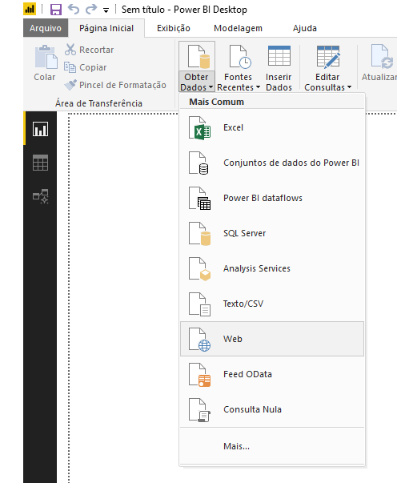
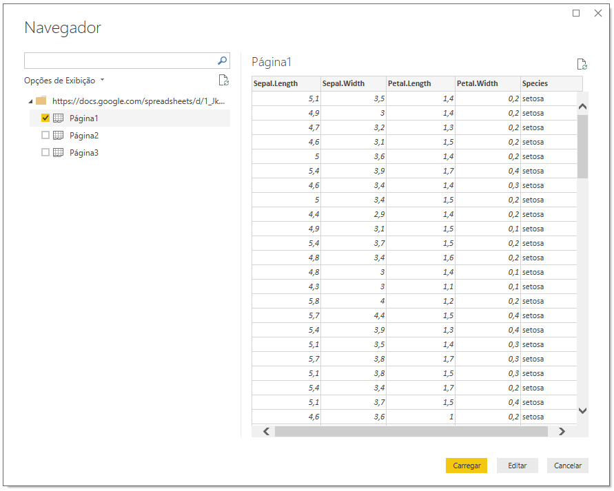
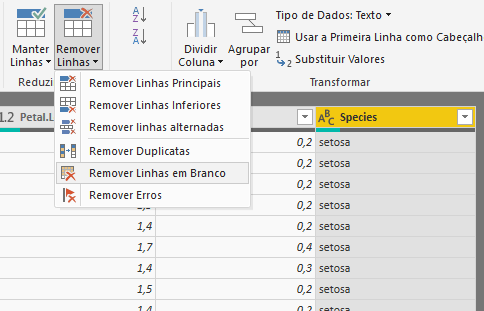
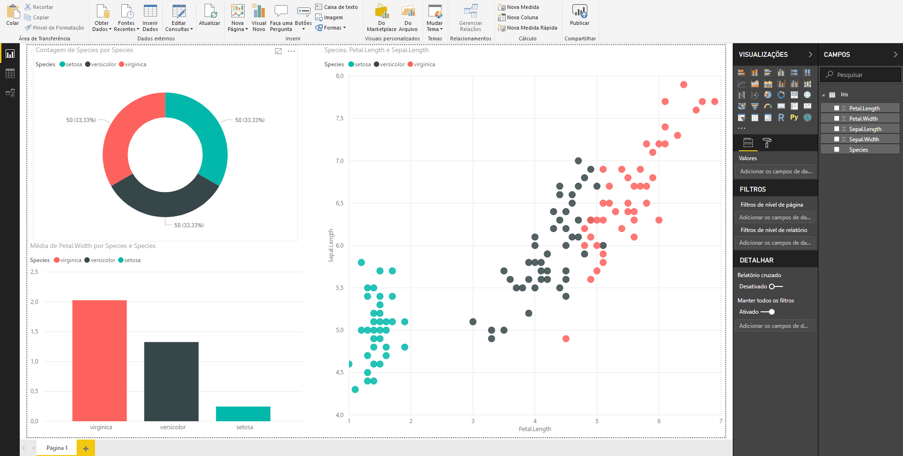

Embora o Power BI nos permita obter dados de inúmeras fontes, infelizmente ele não possui um conector específico para o Google Sheets. No entanto, é possível obter dados de planilhas do Google de uma maneira relativamente simples.

## Exemplo prático

O primeiro passo é alterar as opções de compartilhamento da planilha escolhida para ser a fonte de dados. É necessário que qualquer pessoa com o link possa acessá-la.

{width=50% height=50%}

[EDIT] *Caso seja imprescindível manter a planilha no modo privado, recomendo seguir [este tutorial](https://www.linkedin.com/feed/update/urn:li:activity:6543657597847818240?lipi=urn%3Ali%3Apage%3Ad_flagship3_pulse_read%3Bg%2BNRE%2FsjRpiBS%2BDQm7vZDQ%3D%3D). Entretanto, após publicado, será necessário configurar um gateway local para atualizar os dados no serviço.*

Em seguida, selecionar o conector Web.

{width=50% height=50%}

Uma URL será solicitada, porém, antes é necessário alterar a URL da planilha para o seguinte formato: `https://docs.google.com/spreadsheets/d/[id planilha]/export?format=xlsx&id=[id planilha]`

**Exemplo**: aqui a URL original da planilha utilizada nesta demonstração: `https://cs.google.com/spreadsheets/d/1_JkXMrdyE_F_JPhNz_RXisI0P0vOQt_pi-7SEpsAxo8/edit#gid=0`

Observe que neste caso, `[id planilha]` = `1_JkXMrdyE_F_JPhNz_RXisI0P0vOQt_pi-7SEpsAxo8`.

E agora a URL após a alteração: `https://docs.google.com/spreadsheets/d/1_JkXMrdyE_F_JPhNz_RXisI0P0vOQt_pi-7SEpsAxo8/export?format=xlsx&id=1_JkXMrdyE_F_JPhNz_RXisI0P0vOQt_pi-7SEpsAxo8`

Feita a alteração e informada a URL, o próximo passo é selecionar as páginas que desejamos conectar com o Power BI e então prosseguir da mesma maneira que seria com outras fontes de dados. Neste exemplo eu selecionei somente a *Página1*.

{width=100% height=100%}

E, no modo de edição, apenas removi as linhas em branco e alterei o nome da tabela para *Iris*.

{width=50% height=50%} 

Após fechar e aplicar, tudo pronto para criar os relatórios dinâmicos.

{width=100% height=100%}

## Ponto de atenção

Nos testes que realizei não tive sucesso nos casos que havia tabela dinâmica em uma das páginas do Sheets, mas ao remover a página (ou somente a tabela dinâmica) a conexão foi estabelecida normalmente.

## Conclusão

O Google Sheets está cada vez mais ganhando espaço em ambientes corporativos, onde o MS Excel já foi absoluto. E o Power BI, por sua vez, tem estado cada vez mais presente entre usuários não necessariamente especialistas em Business Intelligence. Portanto, esta interface Power BI x Google Sheets pode se tornar cada vez mais frequente no dia a dia de diversos profissionais e eu espero, sinceramente, que este artigo possa ser útil aos marinheiros de primeira viagem.

*Os arquivos utilizados neste exemplo estão disponíveis no [GitHub](https://drive.google.com/open?id=1ocdHR3_FgfU8DLuSpxpIdL5cfE67xMjj)*