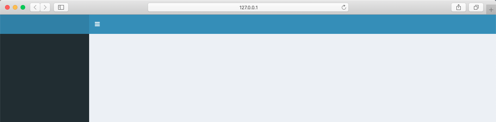
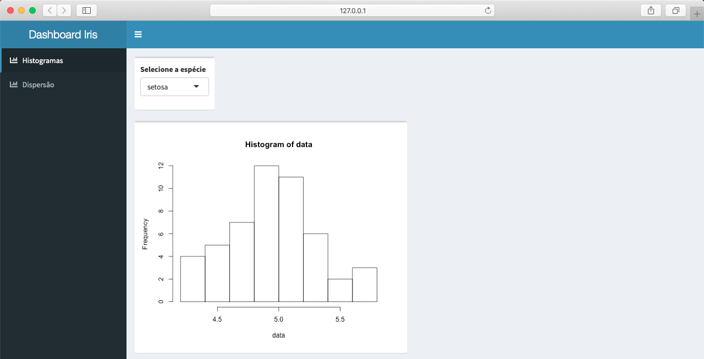
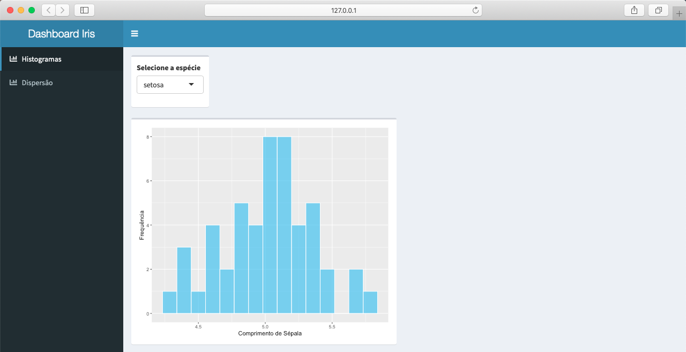
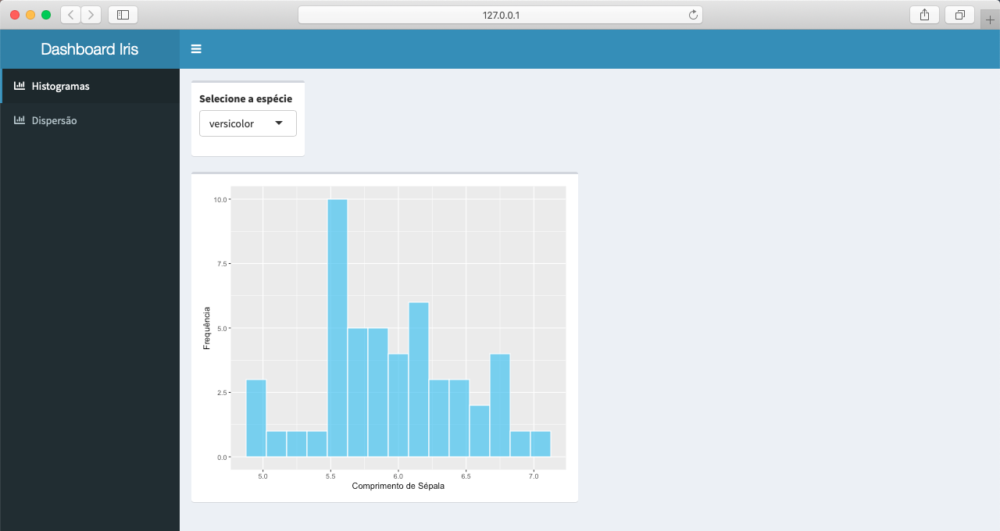
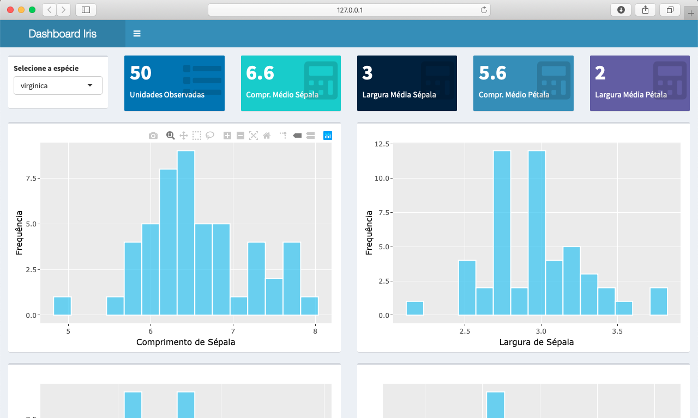

```{r setup, include=FALSE}
knitr::opts_chunk$set(echo = TRUE, message = FALSE, warning = FALSE, eval=FALSE)
```

Quando o objetivo é apenas usufruir de um painel interativo para acompanhamento do negócio e apoio à tomada de decisão, será que é necessário investir em uma plataforma de BI?

Neste artigo vou demonstrar como construir um dashboard interativo e gratuito (desde que publicado em servidor local) com linguagem R e os pacotes Shiny e Plotly.

# Entendendo a aplicação

A ideia é construir um dashboard baseado no clássico conjunto de dados **iris**, que já vem embutido na instalação do R.

O dashboard será composto por duas abas. A primeira, **Histogramas**, irá exibir 4 histogramas (um para cada variável quantitativa do dataset) e a segunda, **Dispersão**, exibirá 2 gráficos de dispersão para comparar comprimento de largura de sépala e pétala das espécies.

Se desejar, o projeto completo está no [GitHub](https://github.com/juniorssz/dashboard-iris). Clique aqui para acessa-lo.

# Estruturando a aplicação

Antes de tudo, certifique-se que possui os pacotes **shiny** e **shinydashboard** instalados. Em seguida, no diretório escolhido, crie dois scripts: **ui.R** e **server.R**. A estrutura básica do Shiny é a seguinte:

```{r}
# ui.R

library(shinydashboard)

ui <- dashboardPage(
  dashboardHeader(),
  dashboardSidebar(),
  dashboardBody()
)


# server.R

library(shiny)

server <- function(input, output) {

}

```

Para testar se tudo está funcionando corretamente, rode a aplicação. O resultado deverá ser este:

{width=100% height=100%}

Em `dashboardHeader() é possível incluir o nome da aplicação. Neste caso resolvi chamar de *Dashboard Iris*:

```{r}
dashboardHeader(title = "Dashboard Iris")
```

Em `dashboardSidebar()`, inclua o menu através da função `sidebarMenu()`:

```{r}
dashboardSidebar(
    sidebarMenu(
      menuItem("Histogramas", tabName = "histogramas", icon = icon("chart-bar")),
      menuItem("Dispersão", tabName = "dispersao", icon = icon("chart-bar"))
    )
  )
```

E em `dashboardBody()`, crie as abas através da função `tabItems()`:

```{r}
dashboardBody(
    tabItems(
      tabItem(tabName = "histogramas", "Testando a aba Histogramas"),
      tabItem(tabName = "dispersao", "Testando a aba Dispersão")
    )
  )
```

Observe que o menu e as abas irão "conversar" através do parâmetro **tabName**.

Ao rodar a aplicação, a aba **Histogramas** será exibida assim:

{width=100% height=100%}

E a aba **Dispersão**, assim:

{width=100% height=100%}

Agora crie um script chamado **data.R** no mesmo diretório dos demais. Através dele iremos carregar o dataset. Para este exemplo, o conjunto de dados utilizado já está embutido na instalação do R, entretanto, poderíamos obter os dados através de algum banco de dados ou API, por exemplo:

```{r}
# data.R

df <- iris
```

É válido mencionar que não é necessário criar um script para isso, mas acredito que desta forma o projeto fica melhor organizado.

Agora é necessário incluir a instruções abaixo nos scripts **ui.R** e **server.R**, caso contrário, o script que acabamos de criar não será enxergado pela aplicação.

```{r}
source("data.R")
```

Até aqui temos construído o esqueleto da aplicação.

O scripts até o momento devem estar assim:

```{r}
# ui.R

library(shinydashboard)
source("data.R")

ui <- dashboardPage(
  
  dashboardHeader(title = "Dashboard Iris"),
  
  dashboardSidebar(
    sidebarMenu(
      menuItem("Histogramas", tabName = "histogramas", icon = icon("chart-bar")),
      menuItem("Dispersão", tabName = "dispersao", icon = icon("chart-bar"))
    )
  ),
  
  dashboardBody(
    tabItems(
      tabItem(tabName = "histogramas", "Testando a aba Histogramas"),
      tabItem(tabName = "dispersao", "Testando a aba Dispersão")
    )
  )
)


# server.R

library(shiny)
source("data.R")

server <- function(input, output) {

}


# data.R

df <- iris
```

# Iniciando os trabalhos

O layout do front-end (ui.R) pode ser orientado a linhas, a colunas ou misto. Neste exemplo vou utilizar a orientação a linhas.

Na aba **histogramas**, crie a primeira linha através da função `fluidRow()`:

```{r}
dashboardBody(
    tabItems(
      tabItem(tabName = "histogramas",
              fluidRow()
              ),
      tabItem(tabName = "dispersao", "Testando a aba Dispersão")
    )
  )
```

Agora a ideia é criar uma caixa de seleção que permita que o usuário escolha qual espécie de flor os gráficos irão exibir os dados.

Antes disso é necessário criar uma **box** para comportar a caixa de seleção:

```{r}
dashboardBody(
    tabItems(
      tabItem(tabName = "histogramas",
              fluidRow(
                box(width = 2)
              )
      ),
      tabItem(tabName = "dispersao", "Testando a aba Dispersão"
      )
    )
  )
```

Observe que a largura (width) da box foi definida como 2. É importante saber que a soma das larguras de todos os componentes de uma `fluidRow()` deve resultar em 12. Ou seja, ao definirmos a box com 2 de largura, significa que o componente ocupará 1/6 da largura da linha.

Agora inclua dentro da box a caixa de seleção através da função `selectInput()`. Observe que *select_specie* é o identificador da caixa de seleção, ou seja, será através deste nome que ela será reconhecida pelo back-end (**server.R**). Outro detalhe é sobre o parâmetro **choices**, repare que as opções de escolha são as espécies de flores contidas na variável **Species** do dataset.

```{r}
tabItem(tabName = "histogramas",
              fluidRow(
                box(width = 2,
                    selectInput(inputId = "select_specie", label = "Selecione a espécie", 
                                choices = unique(df$Species), 
                                selected = 1))
              )
      )
```

Ao rodar a aplicação, este será o resultado:

{width=100% height=100%}

O primeiro histograma será criado na segunda linha do front-end e, da mesma forma que a caixa de seleção, deverá estar contido dentro de uma box.

```{r}
tabItem(tabName = "histogramas",
              fluidRow(
                box(width = 2,
                    selectInput(inputId = "select_specie", label = "Selecione a espécie", 
                                choices = unique(df$Species), 
                                selected = 1))
              ),
              fluidRow(
                box()
              )
      ),
```

Observe que desta vez não foi definida a largura da box. Isto quer dizer que a box ocupará 1/2 da largura da linha.

Agora, inclua dentro da box a função `plotOutput()`. Esta será responsável por renderizar o primeiro histograma.

```{r}
tabItem(tabName = "histogramas",
              fluidRow(
                box(width = 2,
                    selectInput(inputId = "select_specie", label = "Selecione a espécie", 
                                choices = unique(df$Species), 
                                selected = 1))
              ),
              fluidRow(
                box(
                  plotOutput(outputId = "hist_sepal_len"))
              )
      ),
```

Observe que **hist_sepal_len** é o identificador do histograma, que por sinal ainda não foi criado. Será através deste nome que a comunicação ira ocorrer entre front-end e back-end.

O próximo passo é criar o histograma no back-end.

```{r}
server <- function(input, output) {
  output$hist_sepal_len <- renderPlot({


  })
}
```

Primeiro observe que o identificador do histograma criado no front-end se tornou uma variável do objeto **output** e que esta variável recebeu a função `renderPlot()`.

Como os dados que alimentarão o histograma serão em função da espécie selecionada pelo usuário, dentro de `renderPlot()` devemos realizar o slice, de modo que sejam selecionadas somente as observações cuja a variável **Species** seja igual ao valor selecionado na caixa de seleção identificada por **select_specie**.

```{r}
server <- function(input, output) {
  output$hist_sepal_len <- renderPlot({
    data <- df[df$Species == input$select_specie, "Sepal.Length"]

  })
}
```

Por fim a função `hist()` irá plotar o histograma da variável **Sepal.Length**:

```{r}
server <- function(input, output) {
  output$hist_sepal_len <- renderPlot({
    data <- df[df$Species == input$select_specie, "Sepal.Length"]
    hist(data)
  })
}
```

E este é o resultado ao rodar a aplicação:

{width=100% height=100%}

Decepcionante, não? Mas o pacote **ggplot2** pode ajudar a melhorar este histograma (certifique-se que ele esteja instalado).

Para carregar o **ggplot2**, inclua a instrução abaixo nos scripts **ui.R** e **server.R**:

```{r}
library(ggplot2)
```

Agora, para evitar a repetição de código, em **data.R** crie uma função para plotar um histograma através do **ggplot2**. No exemplo abaixo chamei a função de `plot.histogram()`:

```{r}
plot.histogram <- function(df, var, xlab, ylab) {
  out <- ggplot(df, aes_string(x = var)) +
    geom_histogram(bins = 15, fill = "#42c2f5", color = "white", alpha = 0.7) +
    labs(x = xlab, y = ylab)
  return(out)
}
```

Para mais detalhes de como utilizar o ggplot2, acesse este [documento](https://www.rstudio.com/wp-content/uploads/2015/03/ggplot2-cheatsheet.pdf).

Agora que a função está criada, algumas alterações devem ser feitas no back-end. A primeira delas é alterar o slice para que o produto final seja um data frame e não um vetor:

```{r}
data <- df[df$Species == input$select_specie, ]
```

Na sequencia, substitua a função `hist()` por `plot.histogram()`:

```{r}
plot <- plot.histogram(data, "Sepal.Length", "Comprimento de Sépala", "Frequência")
    plot
```

O script **server.R** deverá ficar assim:

```{r}
ibrary(shiny)
library(ggplot2)
source("data.R")


server <- function(input, output) {
  output$hist_sepal_len <- renderPlot({
    data <- df[df$Species == input$select_specie, ]
    plot <- plot.histogram(data, "Sepal.Length", "Comprimento de Sépala", "Frequência")
    plot
  })
}
```

Ao rodar a aplicação, o resultado será este:

{width=100% height=100%}

Observe que o gráfico muda quando outra espécie é selecionada através da caixa de seleção:
{width=100% height=100%}

Mas ainda não podemos dizer que este gráfico está interativo. Para isto vamos precisar do pacote **plotly** (certifique-se que ele esteja instalado).

Para carregar o plotly inclua a instrução abaixo no script **ui.R**:

```{r}
library(plotly)
```

Ainda em **ui.R**, substitua a função `plotOutput()` por `plotlyOutput()`:

```{r}
box(
    plotlyOutput(outputId = "hist_sepal_len"))
```

O script deverá ficar assim:

```{r}
library(shinydashboard)
library(ggplot2)
library(plotly)
source("data.R")

ui <- dashboardPage(
  
  dashboardHeader(title = "Dashboard Iris"),
  
  dashboardSidebar(
    sidebarMenu(
      menuItem("Histogramas", tabName = "histogramas", icon = icon("chart-bar")),
      menuItem("Dispersão", tabName = "dispersao", icon = icon("chart-bar"))
    )
  ),
  
  dashboardBody(
    tabItems(
      tabItem(tabName = "histogramas",
              fluidRow(
                box(width = 2,
                    selectInput(inputId = "select_specie", label = "Selecione a espécie", 
                                choices = unique(df$Species), 
                                selected = 1))
              ),
              fluidRow(
                box(
                  plotlyOutput(outputId = "hist_sepal_len"))
              )
      ),
      tabItem(tabName = "dispersao", "Testando a aba Dispersão"
      )
    )
  )
)
```

Em seguida, em **server.R**, substitua a função `renderPlot()` por `renderPlotly()` e, ao invés de chamar o gráfico através do objeto **plot**, utilize a função `ggplotly()`.

```{r}
server <- function(input, output) {
  output$hist_sepal_len <- renderPlotly({
    data <- df[df$Species == input$select_specie, ]
    plot <- plot.histogram(data, "Sepal.Length", "Comprimento de Sépala", "Frequência")
    ggplotly(plot)
  })
}
```

Ao rodar a aplicação, passe o mouse por cima do histograma e observe que agora ele irá possuir um menu para interação.

Para conhecer mais sobre a integração entre Plotly e Ggplot2, acesse [esta documentação](https://plot.ly/ggplot2/).

Para criar os outros três histogramas o processo é exatamente o mesmo. As únicas coisas que irão mudar em cada plot é o identificador de cada gráfico (outputId) e o nome da variável.

Após as inclusões no código, o corpo do front-end ficará assim:

```{r}
dashboardBody(
    tabItems(
      tabItem(tabName = "histogramas",
              fluidRow(
                box(width = 2,
                    selectInput(inputId = "select_specie", label = "Selecione a espécie", 
                                choices = unique(df$Species), 
                                selected = 1))
              ),
              fluidRow(
                box(
                  plotlyOutput(outputId = "hist_sepal_len")),
                box(
                  plotlyOutput(outputId = "hist_sepal_wid")),
                box(
                  plotlyOutput(outputId = "hist_petal_len")),
                box(
                  plotlyOutput(outputId = "hist_petal_wid"))
                
              )
      ),
      tabItem(tabName = "dispersao", "Testando a aba Dispersão"
      )
    )
  )
```

Observe que, conforme mencionado anteriormente, quando não é especificada a largura da box, por padrão ela assume 1/2 da largura da linha. Isto quer dizer que neste caso, como são quatro boxes, ficarão duas em cada linha.

E o back-end ficará assim:

```{r}
library(shiny)
library(ggplot2)
source("data.R")


server <- function(input, output) {
  
  output$hist_sepal_len <- renderPlotly({
    data <- df[df$Species == input$select_specie, ]
    plot <- plot.histogram(data, "Sepal.Length", "Comprimento de Sépala", "Frequência")
    ggplotly(plot)
  })
  
  output$hist_sepal_wid <- renderPlotly({
    data <- df[df$Species == input$select_specie, ]
    plot <- plot.histogram(data, "Sepal.Width", "Largura de Sépala", "Frequência")
    ggplotly(plot)
  })
  
  output$hist_petal_len <- renderPlotly({
    data <- df[df$Species == input$select_specie, ]
    plot <- plot.histogram(data, "Petal.Length", "Comprimento de Pétala", "Frequência")
    ggplotly(plot)
  })
  
  output$hist_petal_wid <- renderPlotly({
    data <- df[df$Species == input$select_specie, ]
    plot <- plot.histogram(data, "Petal.Width", "Largura de Pétala", "Frequência")
    ggplotly(plot)
  })
}
```

Ao rodar a aplicação, este será o resultado:

{width=100% height=100%}

{width=100% height=100%}

Observe que ficou um espaço em branco na primeira linha, ao lado da caixa de seleção. Podemos preencher este espaço com componentes do tipo **value box**. A largura da caixa de seleção é 2, isto quer dizer que é possível incluir mais cinco objetos com 2 de largura na mesma linha.

A ideia é criar cinco **value boxes** de modo que exibam os seguintes valores:

1. Quantidade de observações
2. Comprimento médio de sépala
3. Largura média de sépala
3. Comprimento médio de pétala
5. Largura média de pétala

E estes valores devem ser exibidos de acordo com a espécie selecionada pelo usuário.

Assim sendo, na primeira linha do front-end, inclua as cinco **value boxes** através da função `valueBoxOutput()`:

```{r}
fluidRow(
                box(width = 2,
                    selectInput(inputId = "select_specie", label = "Selecione a espécie", 
                                choices = unique(df$Species), 
                                selected = 1)),
                valueBoxOutput(width = 2, outputId = "value_observations"),
                valueBoxOutput(width = 2, outputId = "value_sepal_len_mean"),
                valueBoxOutput(width = 2, outputId = "value_sepal_wid_mean"),
                valueBoxOutput(width = 2, outputId = "value_petal_len_mean"),
                valueBoxOutput(width = 2, outputId = "value_petal_wid_mean")
              ),
```

E no back-end, inclua as cinco outputs. Observe que desta vez, ao invés de utilizar a função `renderPlotly()`, a função `renderValueBox()` deve ser utilizada:

```{r}
output$value_observations <- renderValueBox({
    valueBox(
      nrow(df[df$Species == input$select_specie, ]), "Unidades Observadas", icon = icon("list"),
      color = "blue"
    )
  })
  
  output$value_sepal_len_mean <- renderValueBox({
    valueBox(
      round(mean(df[df$Species == input$select_specie, "Sepal.Length"]),1), "Compr. Médio Sépala", icon = icon("calculator"),
      color = "teal"
    )
  })
  
  output$value_sepal_wid_mean <- renderValueBox({
    valueBox(
      round(mean(df[df$Species == input$select_specie, "Sepal.Width"]),1), "Largura Média Sépala", icon = icon("calculator"),
      color = "navy"
    )
  })
  
  output$value_petal_len_mean <- renderValueBox({
    valueBox(
      round(mean(df[df$Species == input$select_specie, "Petal.Length"]),1), "Compr. Médio Pétala", icon = icon("calculator"),
      color = "light-blue"
    )
  })
  
  output$value_petal_wid_mean <- renderValueBox({
    valueBox(
      round(mean(df[df$Species == input$select_specie, "Petal.Width"]),1), "Largura Média Pétala", icon = icon("calculator"),
      color = "purple"
    )
  })
```

Os ícones utilizados são provenientes [desta página](https://fontawesome.com/icons).

Ao rodar a aplicação, o resultado será este:

{width=100% height=100%}

Repare que os valores se alteram quando outra espécie é selecionada:

{width=100% height=100%}

Para finalizar, na aba **Dispersão** serão criados dois gráficos de dispersão. O processo é exatamente o mesmo utilizado com os histogramas, as únicas diferenças estão na função do **ggplot2** e que estes não dependerão de um objeto de entrada, como a caixa de seleção utilizada na aba **Histogramas**.

Para prosseguir, pelo mesmo motivo dos histogramas, crie uma função para plotar os gráficos de dispersão em **data.R**. No exemplo chamei a função de `plot.scatter()`:

```{r}
plot.scatter <- function(df, var.x, var.y, c.factor, xlab, ylab, lname) {
  out <- ggplot(df, aes_string(x = var.x, y = var.y, color = c.factor)) +
    geom_point() +
    labs(x = xlab, y = ylab) +
    scale_color_discrete(name = lname)
  return(out)
}
```

No front-end, a aba dispersão ficará da seguinte forma:

```{r}
tabItem(
        tabName = "dispersao",
        fluidRow(
          box(
            plotlyOutput(outputId = "scatter_1")),
          box(
            plotlyOutput(outputId = "scatter_2"))
        )
      )
```

E no back-end, inclua as duas outputs:

```{r}
output$hist_petal_len <- renderPlotly({
    data <- df[df$Species == input$select_specie, ]
    plot <- plot.histogram(data, "Petal.Length", "Comprimento de Pétala", "Frequência")
    ggplotly(plot)
  })
  
  output$hist_petal_wid <- renderPlotly({
    data <- df[df$Species == input$select_specie, ]
    plot <- plot.histogram(data, "Petal.Width", "Largura de Pétala", "Frequência")
    ggplotly(plot)
  })
```

Ao rodar a aplicação, a aba **Dispersão** ficará da seguinte forma:

{width=100% height=100%}

Pronto, dashboard finalizado! É claro que existem outras inúmeras opções de customização. Para saber mais detalhes, acesse a [documentação](https://rstudio.github.io/shinydashboard/) do **shinydashboard**.

É possível publicar a aplicação em um serviço web da RStudio, o [shinyapps.io](https://www.shinyapps.io/), no entanto, o plano free possui algumas limitações. Este dashboard, inclusive, foi publicado através deste serviço e você pode acessá-lo [clicando aqui](https://juniorssz.shinyapps.io/dashboard-iris/) (o primeiro acesso pode demorar um pouco para renderizar os gráficos).

Lembro que a publicação em servidor local pode ser realizada sem custos.

# Conclusão

Se o objetivo é apenas usufruir de um painel interativo para o acompanhamento do negócio e apoio à tomada de decisão, uma solução baseada em R e Shiny pode ser suficiente, pois além de ser bastante versátil e customizável, pode ser implementada sem custos.

*Este projeto está disponível no [GitHub](https://github.com/juniorssz/dashboard-iris).

# Referências e links úteis

* [https://shiny.rstudio.com](https://shiny.rstudio.com)
* [https://rstudio.github.io/shinydashboard/](https://rstudio.github.io/shinydashboard/)
* [https://www.shinyapps.io/](https://www.shinyapps.io/)
* [https://plot.ly/ggplot2/](https://plot.ly/ggplot2/)
* [https://www.rstudio.com/wp-content/uploads/2015/03/ggplot2-cheatsheet.pdf](https://www.rstudio.com/wp-content/uploads/2015/03/ggplot2-cheatsheet.pdf)
* [https://fontawesome.com/icons](https://fontawesome.com/icons)
* [http://leg.ufpr.br/~walmes/cursoR/data-vis/04-vis-interactive.html](http://leg.ufpr.br/~walmes/cursoR/data-vis/04-vis-interactive.html)
* [https://github.com/pet-estatistica/iguir2/tree/master/shiny](https://github.com/pet-estatistica/iguir2/tree/master/shiny)
* [https://github.com/pet-estatistica/labestData/tree/devel/inst/ShinyApps/labestDataView](https://github.com/pet-estatistica/labestData/tree/devel/inst/ShinyApps/labestDataView)
* [http://shiny.leg.ufpr.br/](http://shiny.leg.ufpr.br/)
* [https://juniorssz.shinyapps.io/dashboard-iris/](https://juniorssz.shinyapps.io/dashboard-iris/)