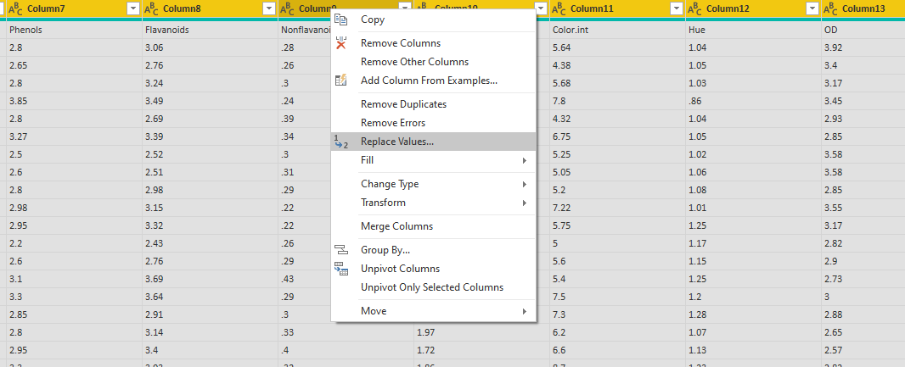

```{r setup, include=FALSE}
knitr::opts_chunk$set(echo = TRUE, message = FALSE, warning = FALSE, eval=FALSE)
```

Mesmo com todos os recursos disponíveis no Power BI para construção de visuais interativos, vez ou outra nos deparamos com requisitos complicados ou até mesmo impossíveis de serem atendidos. Em momentos como estes conhecer um pouco de linguagem R pode fazer total diferença, já que o Power BI permite a preparação e a visualização dos dados com os recursos desta linguagem.

Neste artigo vou demonstrar como levar os belos visuais do pacote Ggplot2 do R para o Power BI. Para seguir o passo a passo você vai precisar ter o **R** e o **RStudio** instalados no seu computador. Não vou entrar em detalhes sobre como realizar as instalações, mas caso ainda não tenha feito, recomendo seguir [este tutorial](http://material.curso-r.com/instalacao/).

Após concluída a instalação do R, abra o Power BI Desktop e acesse `Arquivo > Options and Settings` e, em `Options`, na seção `R scripting`, verifique se a sua instalação local do R é exibida corretamente ou especifique, caso necessário.

<center>
{width=80% height=80%}</center>

# Carregando o conjunto de dados

Antes de tudo irei detalhar o carregamento de um dataset para seguirmos com os exemplos, no entanto, se desejar utilizar outro de sua preferência, fique a vontade para pular esta etapa.

O dataset que escolhi foi o **Wine** da UCI. Para carregá-lo no Power BI Desktop, no menu `Home`, vá em `Get Data > Web` e, no campo `URL`, cole o endereço abaixo e em seguida clique em OK.

*https://gist.githubusercontent.com/tijptjik/9408623/raw/b237fa5848349a14a14e5d4107dc7897c21951f5/wine.csv*

<center>
{width=60% height=60%}

{width=70% height=70%}
</center>

Na caixa **Data Type Detection**, selecione a opção **Do not detect data types** para evitar problemas com conversão de tipos e separadores decimais e depois clique em Load.

<center>
{width=90% height=90%} </center>

O primeiro passo após carregar o conjunto de dados é substituir todos os pontos por vírgula, caso o seu Power BI tenha a vírgula como separador decimal padrão. Para isto, selecione todas as colunas, clique com o botão direito do mouse no cabeçalho da tabela e depois clique em **Replace Values**.

{width=100% height=100%}

Substitua o caracter `.` por `,`, conforme a imagem abaixo:

<center>
{width=80% height=80%}</center>

Na sequência transforme a primeira linha da tabela em cabeçalho. Para isto, no menu **Transform**, clique em Use **First Row as Headers**.

<center>
{width=50% height=50%}</center>

Você vai observar que os nomes de algumas colunas tiveram o ponto substituído por vírgula também. Se desejar, renomeie estas colunas clicando com o botão direito do mouse sobre o cabeçalho e em seguida selecionando **Rename**. Neste exemplo apenas troquei a vírgula por hífen nas colunas que foram afetadas e aproveitei também para alterar o nome da primeira coluna de Wine para Class para deixar mais intuitivo. Se eu tivesse transformado a primeira linha em cabeçalho antes da substituição dos caracteres, o nome das colunas não teriam sido afetados, mas a detecção automática dos tipos teria causado outro problema por conta do separador decimal.

<center>
{width=50% height=50%}</center>

Atente-se aos tipos de cada coluna assumidos automaticamente pelo Power BI. Caso necessário alterá-los, basta clicar no ícone à esquerda do nome da coluna e selecionar o tipo desejado.

<center>
{width=50% height=50%}</center>

A preparação do dataset está concluída, agora vá em `Arquivo > Close & Apply` para aplicar as alterações e fechar o editor de consultas.

<center>
{width=50% height=50%}</center>
Para evitar problemas, salve o arquivo **pbix**. Escolha um nome para o arquivo e um diretório para manter a organização.

# Mãos ao R

A partir daqui iniciarei a construção de um histograma no Power BI utilizando o pacote Ggplot2 do R. Escolhi o histograma para o exemplo pois este tipo de gráfico não é muito prático de se construir utilizando somente os recursos do Power BI.

No Power BI Desktop, em `Visualizations`, selecione `R script visual` e, na sequência, habilite os visuais de script.

<center>
{width=50% height=50%}

{width=50% height=50%}
</center>

O visual ainda em branco irá aparecer na tela. A idéia é trabalhar com ele como se fosse uma tabela, ou seja, selecionando os campos desejados antes de elaborar o script em R. No exemplo, arrastei para **Values** os campos **Class**, **Alcohol** e **Color-Int**, como pode-se observar na imagem abaixo:

{width=100% height=100%}

Neste exemplo o objetivo é trabalhar com todas as linhas do dataset, portanto, para evitar agrupamentos, em **Values**, clique na seta para baixo localizada à direita de cada campo selecionado e certifique-se que a opção **Don’t summarize** esteja habilitada em todos eles. 

<center>
{width=50% height=50%}
</center>

Você vai observar que na parte inferior da tela existe um editor de script do R para que possamos trabalhar com os campos selecionados e elaborar o visual desejado.

{width=100% height=100%}

Eu, particularmente, prefiro usufruir dos recursos do RStudio para redigir o script e depois colar no editor do Power BI, mas para ter acesso a estes mesmos dados no RStudio é necessário exportá-los no formato csv. Para isto, ao passar o mouse sobre o visual em branco (já com os campos desejados selecionados), um menu no canto superior direito irá aparecer. Clique nos **três pontos** e, em seguida, em **Export data**.

<center>
{width=50% height=50%} </center>

Agora no RStudio, em `File > New File > R Script` crie um novo script e salve-o. Em seguida, em `Session > Set Working Directory > Choose Directory` selecione o mesmo diretório utilizado para salvar o dataset exportado em csv. Isto irá facilitar na hora de fazer a leitura do arquivo no RStudio.

<center>
{width=80% height=80%} </center>

Execute o comando abaixo para ler o dataset e armazená-lo no data frame chamado de **df**:

```{r}
df <- read.csv("wines.csv", fileEncoding = "UTF-8-BOM")
```

No console, execute o comando abaixo para verificar a estrutura do data frame, caso deseje.

```{r}
str(df)
```

<center>
{width=80% height=80%}</center>

Instale o pacote **Ggplot2**, caso ainda não tenha feito, através do comando abaixo:

```{r}
install.packages("ggplot2")
```

<center>
{width=80% height=80%}</center>

E, no editor de script, inclua a linha abaixo para carregar o pacote:

```{r}
library(ggplot2)
```

<center>
{width=80% height=80%}</center>

Neste exemplo eu vou criar um histograma da variável Alcohol. Para começar, execute o comando abaixo:

```{r}
ggplot(data = df, mapping = aes(Alcohol)) +
    geom_histogram()
```

{width=100% height=100%}

Você pode incluir, em `aes()`, o argumento abaixo para que as cores do gráfico correspondam às classes do vinho:

```{r}
fill = factor(Class)
```

{width=100% height=100%}

Em `geom_histogram()` é possível incluir os argumentos abaixo para definir os bins do histograma, bem como a transparência e a cor das bordas:

```{r}
geom_histogram(bins = 25, alpha = 0.7, color = "#8f8f8f")
```

{width=100% height=100%}

Adicionando a linha abaixo é possível definir os rótulos dos eixos e o nome da legenda:

```{r}
labs(x = "Álcool (%)", y = "Frequência", fill = "Classe")
```

{width=100% height=100%}

Se assim desejar, é possível alterar as cores do gráfico adicionando a linha abaixo:

```{r}
scale_fill_manual(values = c("#03efd7", "#00bfb3", "#089c8d"))
```

E, por fim, também é possível formatar os rótulos do gráfico adicionando a instrução abaixo:

```{r}
theme(axis.text = element_text(size = 12),
          axis.title = element_text(size = 14, face = "bold"),
          legend.text = element_text(size = 12),
          legend.title = element_text(size = 14, face = "bold"))
```

{width=100% height=100%}

Retornando ao Power BI Desktop, no editor de script do R, observe que o conjunto de de dados está referenciado com o nome **dataset**. No entanto, no RStudio o conjunto de dados foi referenciado com o nome **df**. Portanto, antes de tudo, inclua a linha abaixo no editor do Power BI para atribuir o dataset ao objeto df e poder trabalhar tranquilamente com o script elaborado no RStudio.

```{r}
df <- dataset
```

{width=100% height=100%}

Em seguida, cole o conteúdo do RStudio no editor do Power BI. Não esqueça de ignorar a linha responsável por obter o arquivo csv.

```{r}
library(ggplot2)

ggplot(data = df, mapping = aes(Alcohol, fill = factor(Class))) +
  geom_histogram(bins = 25, alpha = 0.7, color = "#8f8f8f") +
  labs(x = "Álcool (%)", y = "Frequência", fill = "Classe") +
  scale_fill_manual(values = c("#03efd7", "#00bfb3", "#089c8d")) +
  theme(axis.text = element_text(size = 12),
        axis.title = element_text(size = 14, face = "bold"),
        legend.text = element_text(size = 12),
        legend.title = element_text(size = 14, face = "bold"))
```

{width=100% height=100%}

No canto direto da barra escura do editor, clique em executar.

{width=100% height=100%}

Redimensione o objeto para o tamanho desejado e clique em executar novamente para renderizar a alteração.

{width=100% height=100%}

Se desejar, na aba format do menu do gráfico, é possível customizar o título do gráfico.

{width=100% height=100%}

Pronto, o histograma está concluído!

$ Interatividade dos visuais do R no Power BI

Ao contrário dos visuais nativos do Power BI, o gráfico elaborado através do R não tem interatividade quando clicamos ou passamos o mouse sobre ele, no entanto, podemos adicionar filtros para obtermos interatividade. Para adicionar filtros, em `Arquivo > Options and Settings` e, em `Options`, na seção `Preview features`, habilite a opção `New filter experience` e clique em OK.

<center>
{width=80% height=80%}</center>

Em seguida, em em `Arquivo > Options and Settings` e, em `Options`, na seção `Report settings` do grupo `CURRENT FILE`, habilite a opção `Enable the updated filter pane, and show filters in the visual header for this report`.

<center>
{width=80% height=80%}</center>

Agora o painel de filtros estará disponível para incluirmos os campos desejados.

<center>
{width=80% height=80%}</center>

No exemplo inclui o campo Class como filtro da página. Observe que, ao selecionar somente as classes 1 e 2, o gráfico é atualizado.

{width=100% height=100%}

# Conclusão

Construir um visual utilizando puramente os recursos do Power BI geralmente é muito mais prático e intuitivo do que o que foi visto aqui, no entanto, há situações que somente estes recursos não são suficientes para atendermos determinados requisitos com agilidade, pois algumas vezes precisamos elaborar expressões complexas em DAX ou até fazer alterações nas consultas, o que pode tornar o processo bastante demorado. Diante de situações semelhantes, preparar os dados e elaborar visuais com R pode ser bastante conveniente.

*Os arquivos utilizados estão disponíveis para [download](https://drive.google.com/drive/folders/1t6Rd56TAsQX1AVDwvdU2pA7JuJ3Mj1Vx?usp=sharing)*

# Referências e links úteis

* [https://docs.microsoft.com/pt-br/power-bi/desktop-r-visuals](https://docs.microsoft.com/pt-br/power-bi/desktop-r-visuals)
* [https://docs.microsoft.com/pt-br/power-bi/power-bi-report-filter](https://docs.microsoft.com/pt-br/power-bi/power-bi-report-filter)
* [http://material.curso-r.com/instalacao/](http://material.curso-r.com/instalacao/)
* [https://archive.ics.uci.edu/ml/datasets/Wine](https://archive.ics.uci.edu/ml/datasets/Wine)
* [https://gist.githubusercontent.com/tijptjik/9408623/raw/b237fa5848349a14a14e5d4107dc7897c21951f5/wine.csv](https://gist.githubusercontent.com/tijptjik/9408623/raw/b237fa5848349a14a14e5d4107dc7897c21951f5/wine.csv)
* [http://leg.ufpr.br/~walmes/cursoR/data-vis/03-vis-ggplot2.html](http://leg.ufpr.br/~walmes/cursoR/data-vis/03-vis-ggplot2.html)
* [https://ggplot2.tidyverse.org/](https://ggplot2.tidyverse.org/)
* [https://www.rstudio.com/wp-content/uploads/2015/03/ggplot2-cheatsheet.pdf](https://www.rstudio.com/wp-content/uploads/2015/03/ggplot2-cheatsheet.pdf)