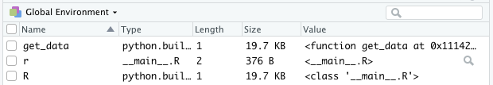
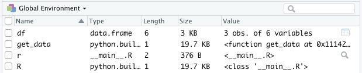
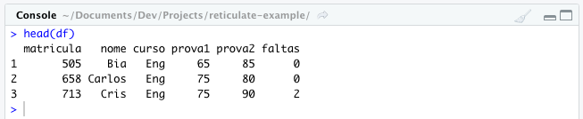

```{r setup, include=FALSE}
knitr::opts_chunk$set(echo = TRUE, message = FALSE, warning = FALSE)
```

Há alguns dias, atuando em um projeto em R, necessitei de um recurso que eu estava mais habituado utilizar em Python, então decidi pesquisar como chamar um *script.py* no meu projeto. Foi aí que eu descobri o pacote **reticulate**.

De acordo com a definição encontrada na página do pacote, o **reticulate** fornece um conjunto abrangente de ferramentas para interoperabilidade entre **Python** e **R**.

Vou dar um pequeno exemplo de uso. Para mais detalhes, acesse a [documentação](https://rstudio.github.io/reticulate/).

# Mãos à obra

No diretório escolhido, crie um script **Python**. No meu caso, chamei de *data_example.py*. O conteúdo desse script é uma função chamada `get_data()` que retorna um *Pandas data frame*.

```{python, eval=FALSE}
import pandas as pd

def get_data():
    df = pd.DataFrame({
    "matricula": [505, 658, 713], 
    "nome": ["Bia", "Carlos", "Cris"], 
    "curso": ["Eng", "Eng", "Eng"], 
    "prova1": [65, 75, 75],
    "prova2": [85, 80, 90],
    "faltas": [0, 0, 2]}, index = list(range(1, 4)))
    return df
```

Agora, no mesmo diretório, crie um script **R**. Eu resolvi chamar de *main.R*. Certifique-se que já tenha efetuado a instalação do pacote **reticulate** e carregue-o. Para o exemplo, vou utilizar o pacote **ggplot2**, então pode carregá-lo também.

```{r}
library(reticulate)
library(ggplot2)
```

Agora, através da função use_python(), informe o path da versão desejada do Python:

```{r, eval=FALSE}
use_python("/Users/juniorssz/opt/anaconda3/bin/python3.7", required = T)
```

No caso estou utilizando a versão do Anaconda. Caso esteja utilizando outra versão, não esqueça de se certificar que o Pandas já está instalado, caso esteja seguindo passo a passo.

Em seguida, através da função `source_python()`, carregue o script python que foi criado anteriormente:

```{r, eval=FALSE}
source_python("data_example.py")
```



Observe que a função `get_data()` criada no script *data_example.py* já aparece como um objeto do R. Então vamos utilizá-la!

```{r, eval=FALSE}
df <- get_data()
```

Lembra que o retorno de *get_data()* era uma Pandas data frame? Agora, ao atribuir ao objeto **df**, temos um data frame do **R**:



Será que a conversão ocorreu perfeitamente?

```{r, eval=FALSE}
head(df)
```



Pelo visto sim, não é?

Para finalizar, vamos plotar um gráfico de colunas através do **ggplot2**:

```{r, echo=FALSE}
df = data.frame(nome=c('Bia', 'Carlos', 'Cris'), prova2=c(85, 80, 90))
```

```{r}
ggplot(df, aes(x = nome, y = prova2)) +
  geom_col(fill = "blue", color = "blue", alpha = 0.7) +
  labs(title = "Avaliação 2", x = "Aluno", y = "Nota")
```

# Considerações finais

Sempre achei totalmente sem sentido esse papo de "R é melhor que Python" e vice-versa, afinal de contas, acredito que estas duas excelentes ferramentas possuem pontos fortes distintos e que extrair o que cada uma tem de melhor pode ser um grande diferencial.

Este foi um pequeno exemplo de aplicação com interoperabilidade entre **Python** e **R**. Para mais detalhes, recomendo que explore a [documentação](https://rstudio.github.io/reticulate/) do pacote, assista [este vídeo](https://rstudio.com/solutions/r-and-python/) na página do **RStudio** e tenha sempre em mãos esta [folha de referência](https://github.com/rstudio/cheatsheets/blob/master/reticulate.pdf) (cheat sheet).

*Este exemplo está disponível no [GitHub](https://github.com/juniorssz/reticulate-example).*

# Referências e links úteis

* [https://github.com/juniorssz/reticulate-example](https://github.com/juniorssz/reticulate-example)
* [https://rstudio.github.io/reticulate/](https://rstudio.github.io/reticulate/)
* [https://github.com/rstudio/cheatsheets/blob/master/reticulate.pdf](https://github.com/rstudio/cheatsheets/blob/master/reticulate.pdf)
* [https://rstudio.com/solutions/r-and-python/](https://rstudio.com/solutions/r-and-python/)
* [http://leg.ufpr.br/~walmes/ensino/dsbd-linprog/slides/01-python-pandas.html](http://leg.ufpr.br/~walmes/ensino/dsbd-linprog/slides/01-python-pandas.html)